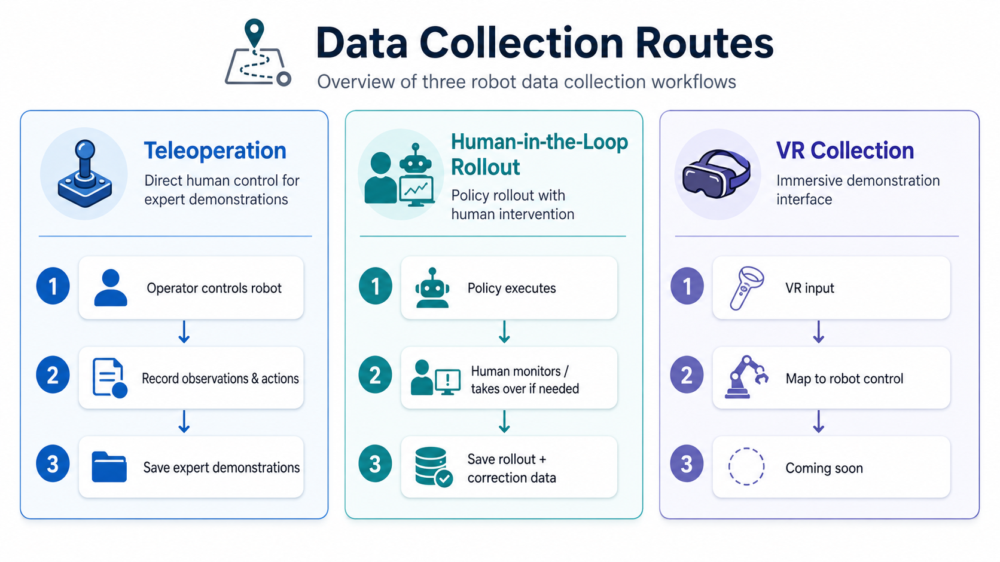

# Data Collection

A unified data collection toolkit for robot learning, including teleoperation-based demonstration collection, human-in-the-loop rollout collection, and future VR-based data collection.

**Core contributors:** Xiaoquan Sun, Zetian Xu

## 📌 Contents

- [🔥 News](#-news)
- [📝 TODO](#-todo)
- [📖 Project Overview](#-project-overview)
- [🧩 Modules](#-modules)
- [🎮 Teleoperation](#-route-1-teleoperation)
- [🤝 Human-in-the-Loop Rollout](#-route-2-human-in-the-loop-rollout)
- [🥽 VR Collection](#-route-3-vr-collection)
- [⚡ Quick Start](#-quick-start)
- [🗂️ Directory Structure](#️-directory-structure)
- [🛠️ Development Notes](#️-development-notes)
- [🙏 Acknowledgements](#-acknowledgements)
- [📮 Contact](#-contact)
- [📄 License](#-license)

## 🔥 News

- 2026/05/10 🌟 Initial open-source project structure is prepared, including Teleoperation, Human-in-the-Loop Rollout, and VR placeholders.

## 📝 TODO

- [ ] Add VR-based data collection support.

## 📖 Project Overview

This repository organizes multiple robot data collection workflows under one project root. The goal is to provide clean, reusable collection entry points for imitation learning, robot policy learning, Vision-Language-Action models, world models, and real-robot learning experiments.

Each module is designed to be self-contained so that hardware-specific setup, runtime configuration, and collection tools can evolve independently while sharing a consistent top-level structure.

The current project contains three collection routes:

1. **Teleoperation**: collect expert demonstrations through direct human control.
2. **Human-in-the-Loop Rollout**: let a policy execute first, while a human operator monitors and takes over when correction or recovery is needed.
3. **VR Collection**: a future interface for immersive robot demonstration collection.

<p align="center">
  
</p>

## 🧩 Modules

| Module | Status | Description |
| --- | --- | --- |
| [Teleoperation](./teleoperation) | Available | Piper teleoperation data collection with multi-camera support. |
| [Human-in-the-Loop Rollout](./human_inloop) | Available | Rollout data collection with human intervention/takeover, following the `lerobot-human-inloop-record` style workflow. |
| [VR](./VR) | Coming soon | VR-based data collection interface. |

## 🎮 Teleoperation

Teleoperation is used for collecting expert demonstrations by directly controlling the robot. This route is suitable for collecting clean imitation learning demonstrations where the human operator performs the task from start to finish.

Typical workflow:

1. Start the collection script.
2. Initialize the Piper robot and multi-camera system.
3. Human operator directly controls the robot.
4. Record synchronized observations, robot states, and actions.
5. Save demonstration episodes for downstream training.

```bash
cd teleoperation
bash scripts/collect_data.sh
```

See [Teleoperation](./teleoperation) for Piper hardware setup, configuration, dry-run checks, and recording commands.

## 🤝 Human-in-the-Loop Rollout

Human-in-the-Loop Rollout collection is used when a trained or partially trained policy is deployed on the robot first. The human operator monitors the rollout and takes over when the policy is about to fail, behaves unsafely, or requires correction.

This route is useful for collecting both autonomous rollout segments and human recovery / correction segments. The resulting data can be used for policy improvement, fine-tuning, recovery learning, and iterative real-robot training.

Typical workflow:

1. Load a policy or model for robot rollout.
2. Run the policy on the robot under human supervision.
3. Trigger human intervention when needed.
4. Record autonomous segments and intervention segments together.
5. Use the collected data for SFT training.

```bash
cd human_inloop
```

See [Human-in-the-Loop Rollout](./human_inloop) for rollout collection with policy execution and human takeover/correction segments.

## 🥽 VR Collection
This module is Coming soon.

## ⚡ Quick Start

Clone the repository and enter the project root:

```bash
git clone https://github.com/Agentic-Intelligence-Lab/data_collection.git
cd data_collection
```

Open a module and follow its own README or scripts:

```bash
cd teleoperation
bash scripts/collect_data.sh
```

For human-in-the-loop rollout collection:

```bash
cd human_inloop
```

For VR-based collection:

```bash
cd VR
```

> Note: each module may require different robot hardware, camera devices, Python environments, and runtime configuration. Check the module-level documentation before running hardware-facing scripts.

## 🗂️ Directory Structure

```bash
data_collection/
├── README.md
├── docs/
│   └── assets/
│       └── data_collection_workflow_comparison.png
├── teleoperation/
├── human_inloop/
└── VR/
    └── README.md
```

## 🛠️ Development Notes

- Keep each collection route self-contained.
- Keep hardware-specific configuration inside the corresponding module.

## 🙏 Acknowledgements

Our project has been built upon a strong foundation laid by previous work: [LeRobot](https://github.com/huggingface/lerobot), [Evo-RL](https://github.com/MINT-SJTU/Evo-RL).

## 📮 Contact

If you have any questions about the code, please propose issues, pull requests, or directly contact Xiaoquan Sun at sunxiaoquan@hust.edu.cn.

## 📄 License

License information will be added before the official release.
